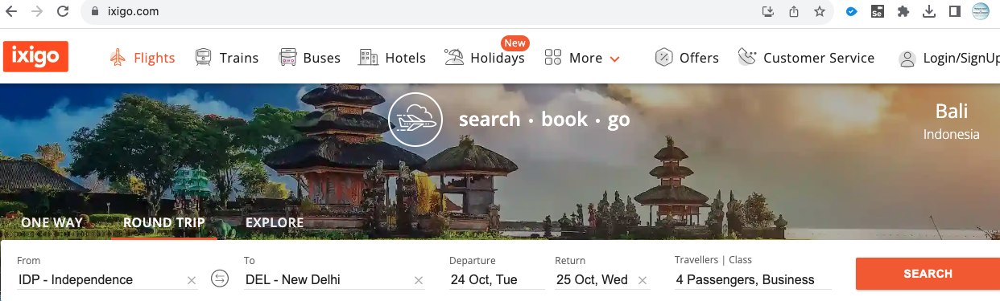

### Project Question

**Instructions:**

1. When you open the workspace, click "ACCEPT" in the lower-right corner of the REDHAT notification to enable import package suggestions while working on Selenium scripts.

2. Ensure that you do not make any changes to the existing main class file.

3. Common Maven Commands for Selenium:

   - To change to a specific directory: cd /path of your maven project

   - To run all test cases: mvn clean test

   - To change to a parent directory: cd ..

4. To view the running scripts,

   - Click on port 8081, and you'll be directed to a new window. In the URL bar of this new window, replace "8081" with "4444" to access the Selenium Grid.

   - Perform the same procedure again, but replace "8081" with "7900" for VNC server page

   - To view the execution, click on the "connect" button on the VNC server page and enter the password "secret".

5. If you need to terminate an active session in the Selenium Grid, you can click on the "reset grid" button located next to the "reload ide" button.

6. To execute your test scripts, click Run Test Case.

7. To submit your code, click "Submit Project" and to end the Test by clicking "Submit Test", where you find dialog box enter the text **"END"**.

---

**Question 01**

Use the appropriate TestNG annotation for the cases and generate the TestNG reports. (i.e., @BeforeTest, @AfterTest, @BeforeMethod, @AfterMethod, etc.,)

Navigate to https://www.ixigo.com

1. Click on the "**Round Trip".**

2. Locate the input field labelled as **“FROM”**.

3. Input the city (for example, " IDP - Independence ") into the input field.

4. Locate the input field labelled as **“TO”**.

5. Input the city (for example, " DEL - New Delhi ") into the input field.

6. Identify the input field labelled as "**Departure**."

7. Utilize the date picker to select an appropriate departure-date

8. Locate the input field labelled as "**Return**."

9. Use the date picker to choose a suitable return-date.

10. Click on the **"Travellers and class"** section. Within this section, increase the value by 1 for Adults and also increase the value by 1 for Child from the default value. Then under the class section choose **“Business”** option.

11. Once selections are made, click the **"Search”** button.

**Note: To see the TestNG report, click on the surefire-output folder.**
