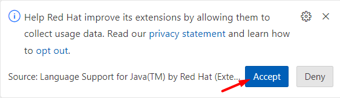
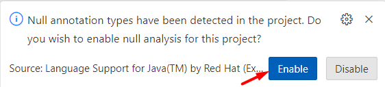
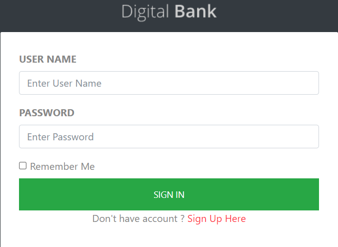
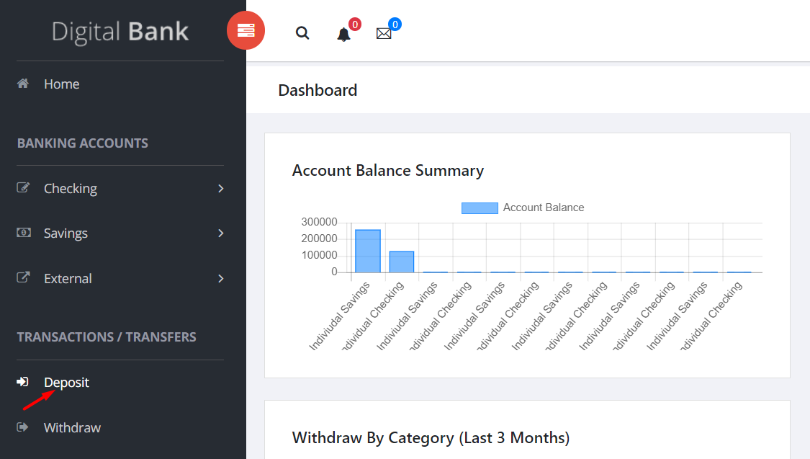
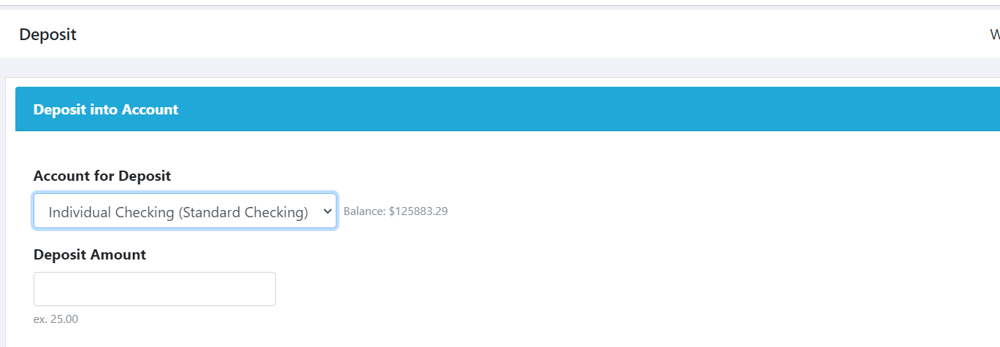
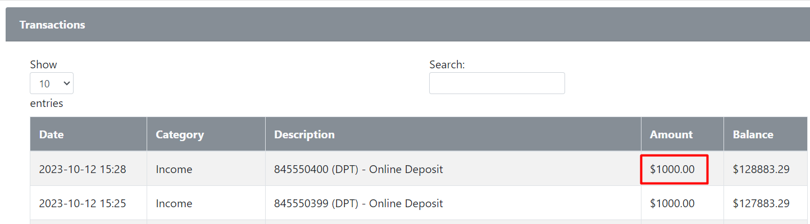
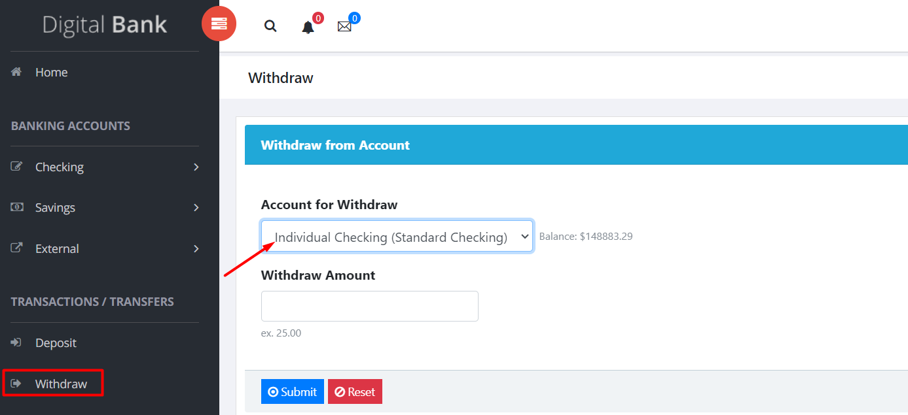

## Project Question

**URL**: http://dbankdemo.com/bank/login

1. Build a Data Driven Automation framework using the above URL.

2. Utilize the utilities available in the framework to:

   - Read data from the excel file
   - Create an TestNG report.

3. Design at least 3 independent test cases in the framework.

4. Each test case must have a navigation of at least 2 pages.

**Instructions:**

1. When you open the workspace, click "ACCEPT" in the lower-right corner of the REDHAT notification to enable import package suggestions while working on Selenium scripts.

2. Ensure that you do not change the existing main class file.

3. Common Maven Commands for Selenium:

   - To change to a specific directory: cd /path of your maven project
   - To run all test cases: mvn clean test
   - To change to a parent directory: cd ..

4. To view the running scripts,

- Click on port 8081, and you'll be directed to a new window. In the URL bar of this new window, replace "8081" with "4444" to access the Selenium Grid.
- Perform the same procedure again, but replace "8081" with "7900" for the VNC server page
- To view the execution, click on the "connect" button on the VNC server page and enter the password "secret".

5. If you need to terminate an active session in the Selenium Grid, you can click on the "reset grid" button located next to the "reload ide" button.

6. To execute your test scripts, click Run Test Case.

7. To submit your code, click "Submit Project" and to end the Test by clicking "Submit Test", where you find a dialog box enter the text **"END"**.

---

**Testcase 1:**

1. Open a web browser and navigate to the URL: http://dbankdemo.com/bank/login

2. Click on the username and enter the value "S@gmail.com" from the feature file using the scenario outline.

3. Click on the password and enter the value "P@ssword12" from the feature file using the scenario outline.

4. Click the "Sign In" button.

5. Verify the result of a successful login by verifying the redirected URL contains the keyword "home" .

**Testcase 2:**

1. Open a web browser and navigate to the URL: http://dbankdemo.com/bank/login

2. Click on the username and enter the value "S@gmail.com".

3. Click on the password and enter the value "P@ssword12".

4. Click the "Sign In" button. You will be redirected to a new page.

5. Click on the "Deposit" option.

5. Choose the "Individual Checking (Standard Checking)" by selecting the "Select account" dropdown, for the deposit.

6. Input the deposit amount, 5000 in the textbox.

7. Click the submit button to be redirected to the deposited amount page.

8. Scroll down on the page and verify the deposited amount is present in the below table.

**Testcase 3:**

1. Open a web browser and navigate to the URL: http://dbankdemo.com/bank/login

2. Click on the username and enter the value "S@gmail.com".

3. Click on the password and enter the value "P@ssword12".

4. Click the "Sign In" button. You will be redirected to a new page.

5. Click on the "Withdraw" option.

6. Choose the "Individual Checking (Standard Checking)" account for withdrawal.

6. Enter the withdrawal amount 3000 and click the submit button.

7. Scroll down on the redirected page and verify the withdrawal amount is present in table below table

> Note: To see the TestNG report , see the sure-fire output folder.
