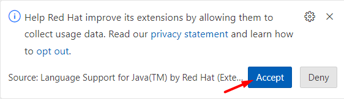
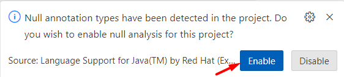
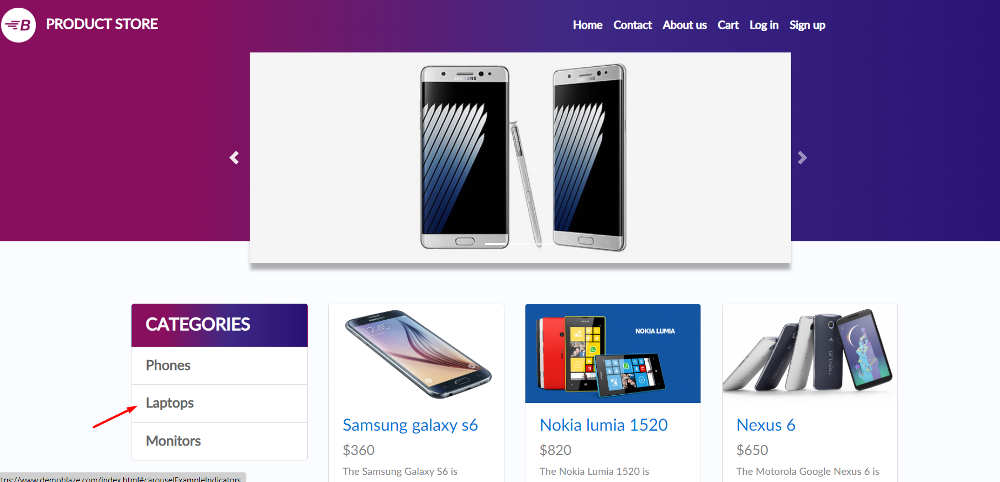
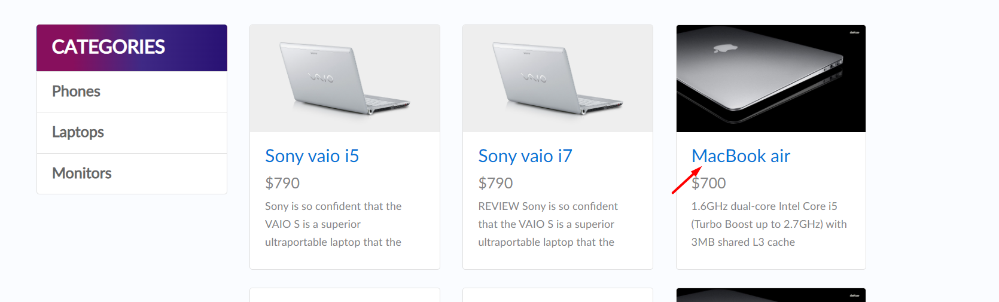
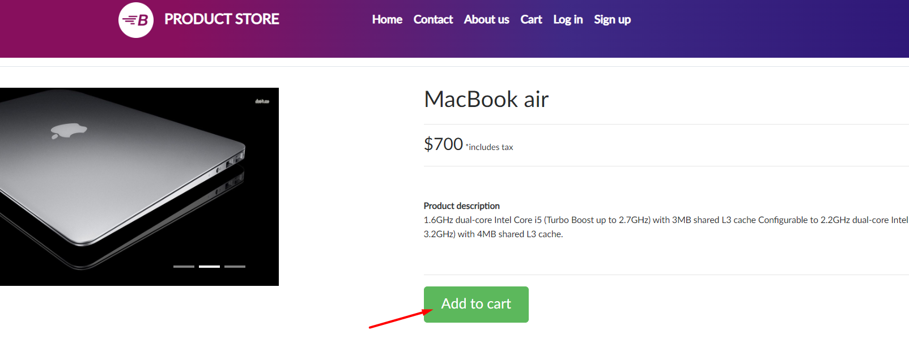
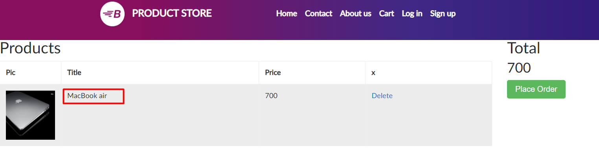
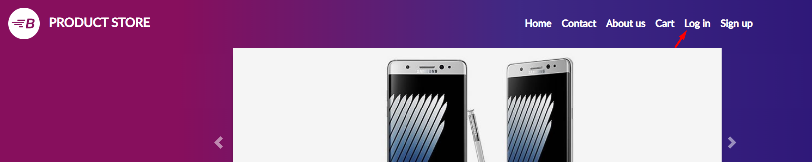
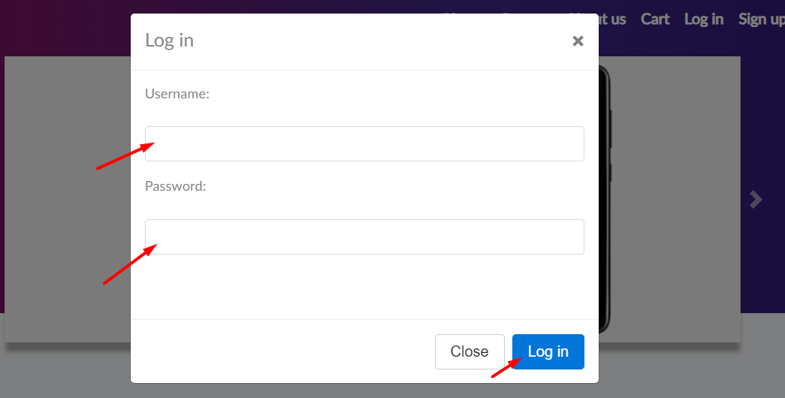
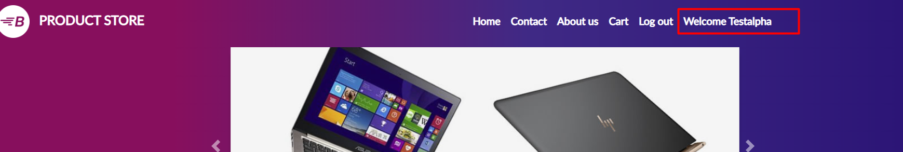

### Project Question

**URL**: https://www.demoblaze.com/

1. Build a Data Driven Automation framework using the above URL.

2. Utilize the utilities available in the framework to:

- Perform Excel read for test data.
- Create an TestNG report.

3. Design at least 2 independent test cases in the framework.

4. Each test case must have a navigation of at least 2 pages.

**Instructions:**

**1\. When you open the workspace, click "ACCEPT" in the lower-right corner of the REDHAT notification to enable import package suggestions while working on Selenium scripts.**

**2\. Ensure that you do not change the existing main class file.**

**3\. Common Maven Commands for Selenium:**

- To change to a specific directory: cd /path of your maven project
- To run all test cases: mvn clean test
- To change to a parent directory: cd ..

4\. To view the running scripts,

- Click on port 8081, and you'll be directed to a new window. In the URL bar of this new window, replace "8081" with "4444" to access the Selenium Grid.
- Perform the same procedure again, but replace "8081" with "7900" for the VNC server page
- To view the execution, click on the "connect" button on the VNC server page and enter the password "secret".

5\. If you need to terminate an active session in the Selenium Grid, you can click on the "reset grid" button located next to the "reload ide" button.

6\. To execute your test scripts, click Run Test Case.

7\. To submit your code, click "Submit Project" and to end the Test by clicking "Submit Test", where you find a dialog box enter the text **"END"**.

**Testcase1:**

1\. Go to the website: https://www.demoblaze.com/

2\. On the left-hand side, look for the section labeled "Categories." Within this section, click on "Laptops."

3\. You will be directed to a results page. On this page, select "MacBook air." and save the product name for future reference.

4\. After selecting the product, you will be taken to a specific product page. Locate the "Add to cart" button below the product description and click on it.

5\. An alert will pop up; click the "OK" button on the alert.

6\. In the top navigation bar, find and click on the "Cart" option. This will take you to the shopping cart page.

7\. On the shopping cart page, you will find details of the product you selected. Verify the selected product name and displayed product name match.

**Testcase2:**

1\. Go to the website: https://www.demoblaze.com/

2\. Click on the "Log in" option located on the top navigation bar.

3\. When the login popup appears, click on the username input box and enter "Testalpha" (this value should be sourced from an Excel file).

4\. Click on the password input box and enter "Test@123" (this value should also be sourced from an Excel file).

5\. Click on the "Login" button, then confirm the login was successful by checking for the message "Welcome Testalpha" in the redirected page navbar.

**Note: To see the report file, click on surefire-output folder.**
